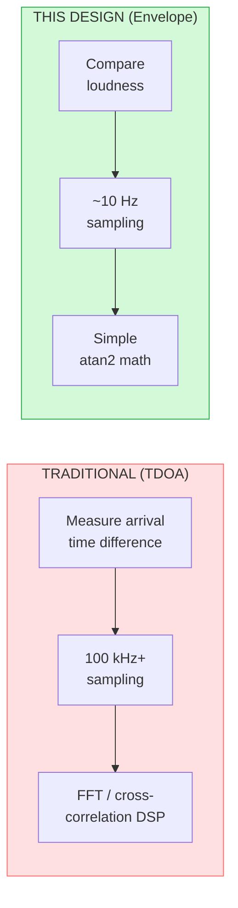
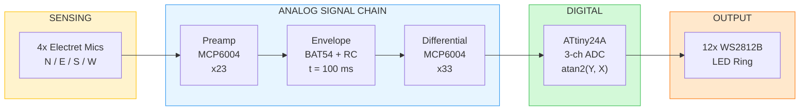
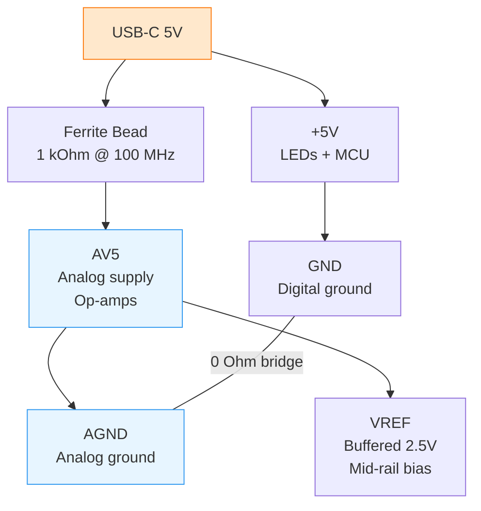
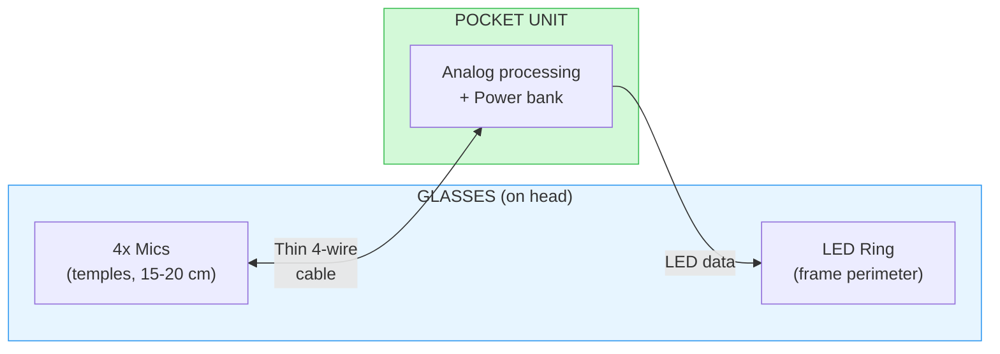

# Sound Direction Indicator

> Hear with your eyes. A visual alert for sounds around you.


-orange)


---

## TL;DR

A $10 device that shows deaf users **where** sound is coming from. Four microphones detect direction, a ring of LEDs points toward it. Plug into any USB power bank — no app, no pairing, no setup.

**The interesting engineering problem:** Traditional sound localization requires 100 kHz+ sampling and complex DSP. I found a way to do it with a **$1 microcontroller, 10 Hz sampling, and under 30 bytes of RAM** — by solving the problem in the analog domain instead of the digital one.

---

## The Problem

Deaf and hard-of-hearing individuals miss critical environmental sounds — doorbells, alarms, someone calling from another room. Existing solutions are expensive, require smartphone apps, or involve complex setup.

---

## The Solution


Plug into any USB power bank → Device detects sound → LED ring shows direction and intensity.

**No app. No pairing. No configuration.**

---

## Key Features

<table>
<tr>
<td align="center" width="25%">
<h3>🎯 360° Awareness</h3>
4 microphones (N/E/S/W)<br>
12 LED sectors<br>
30° resolution
</td>
<td align="center" width="25%">
<h3>💡 Intensity Display</h3>
🔵 Blue = Moderate<br>
🔴 Red = Loud<br>
Intuitive at a glance
</td>
<td align="center" width="25%">
<h3>🔌 Universal Power</h3>
USB-C input<br>
Power bank compatible<br>
Phone OTG compatible
</td>
<td align="center" width="25%">
<h3>💰 Ultra Low Cost</h3>
~$10 per unit<br>
~106 components<br>
Hand-solderable
</td>
</tr>
</table>

---

## Skills Demonstrated

> **For recruiters:** This project demonstrates end-to-end hardware product design — from initial trade-off analysis through analog circuit design, PCB layout, and firmware architecture — with a focus on solving the right problem at the right abstraction level.

| Domain | What I Did | Why It Matters |
|--------|-----------|----------------|
| **System Architecture** | Evaluated two fundamentally different approaches (TDOA vs. envelope detection); chose amplitude comparison to eliminate DSP entirely | Shows I optimize at the architecture level, not just the implementation level |
| **Analog Circuit Design** | Designed a 4-channel signal chain: electret preamps (×23), Schottky envelope detectors, differential amplifiers (×33) — all from a single 5V USB supply | Demonstrates practical analog design with real-world constraints |
| **Noise Engineering** | Split ground planes, ferrite-isolated analog rail, differential topology for common-mode rejection, 100 nF decoupling at every mic and LED | Shows I think about what can go wrong, not just what should go right |
| **PCB Layout** | 2-layer 80 mm circular board with zero-via mic traces, +5V inductive ring, and strategic ground partitioning | Shows understanding of how layout affects analog signal integrity |
| **Firmware Design** | ATtiny24A: 3-ch ADC → `atan2(Y,X)` → WS2812B; under 1 KB flash, under 30 bytes RAM | Shows I match the solution to the problem — no over-engineering |
| **Cost Engineering** | Full BOM sourced and priced; every component evaluated for availability, cost, and hand-solderability | Shows product thinking, not just prototype thinking |
| **Design for Evolution** | Architecture validated for wearable glasses form factor — same analog chain transfers directly | Shows I design systems with a future, not just for today |

### The Decision That Defined the Project

The most impactful engineering decision was not a component choice or a circuit trick — it was **reframing the problem**:

> *"Don't measure when the sound arrives. Measure how loud it is on each side."*

This single insight eliminated the need for high-speed ADC, FFT, cross-correlation, trace-length matching, large RAM buffers, and a powerful MCU. It reduced a $30+ DSP problem to a $10 analog one.

---

## The Key Innovation



**Amplitude comparison instead of time-of-arrival.** One architectural decision, seven downstream benefits:

| What It Eliminates | What It Enables |
|-------------------|-----------------|
| 100 kHz+ sampling requirement | ~10 Hz ADC reads are sufficient |
| FFT / cross-correlation DSP | Simple `atan2(Y, X)` in firmware |
| Critical PCB trace-length matching | Relaxed layout — no matched pairs |
| Large MCU (ATmega328P+) | Minimal MCU (ATtiny24A, 2 KB flash) |
| Large RAM buffers for audio | Under 30 bytes total RAM |
| High-speed ADC, DMA, capture timers | Basic ADC + GPIO only |
| Complex firmware (thousands of lines) | Under 1 KB, simple loop |

---

## Specifications

| Parameter | Value |
|-----------|-------|
| Direction Resolution | 12 sectors (30° each) |
| Response Time | 100–150 ms (adjustable via single capacitor) |
| Power Consumption | ~270 mA typical |
| Input Voltage | 5V USB-C |
| PCB Size | 80 mm circular, 2-layer |
| Component Count | ~106 |
| Firmware Size | < 1 KB flash, < 30 bytes RAM |
| Unit Cost | ~$10 at volume |

---

## System Architecture



| Stage | Function | Key Detail |
|-------|----------|------------|
| **Preamp** | Amplify mic signals ×23 | Non-inverting, MCP6004 rail-to-rail |
| **Envelope** | Extract amplitude (1.6 Hz BW) | BAT54 Schottky + 10 kΩ / 10 µF RC |
| **Differential** | X = East−West, Y = North−South | ×33 gain, cancels common-mode noise |
| **MCU** | Compute angle, drive LEDs | `atan2(Y, X)` → 12-sector mapping |

---

## How It Works

### Direction Extraction

The system computes sound direction from two differential signals:

```
X = 33 × (Envelope_East − Envelope_West)
Y = 33 × (Envelope_North − Envelope_South)
angle = atan2(Y, X)
sector = (angle + 15°) / 30°      → maps to 1 of 12 LEDs
```

### Noise Immunity

The 100 ms envelope filter provides massive rejection of high-frequency interference:

| Noise Source | Rejection |
|--------------|-----------|
| WS2812B switching (800 kHz) | > 100 dB |
| RF pickup (MHz range) | > 100 dB |
| Audio-frequency EMI (1 kHz) | ~56 dB |
| Mains hum (50/60 Hz) | ~30 dB |

**Differential topology** cancels common-mode power supply noise — even if USB cable noise is rectified by the envelope detectors, it appears equally on all four channels and subtracts out:

```
(V_North + V_Noise) − (V_South + V_Noise) = V_North − V_South
```

### Adjustable Response Time

A single capacitor swap tunes the speed vs. stability trade-off — no circuit redesign:

| Capacitor | Time Constant | Use Case |
|-----------|---------------|----------|
| 10 µF (default) | 100 ms | Balanced response and stability |
| 4.7 µF | 47 ms | Faster response |
| 1 µF | 10 ms | Very fast, less stable |

---

## Hardware Documentation

📄 **[View Schematic & PCB Layout (PDF)](docs/schematic-and-pcb.pdf)**

### PCB Layout Highlights

| Design Choice | Rationale |
|---------------|-----------|
| **Zero-via mic traces** | High-impedance mic signals routed on top layer only — no vias — to minimize parasitic inductance |
| **Split ground planes** | AGND and GND joined via 0 Ω resistor at USB entry; prevents digital switching currents from flowing through analog ground |
| **+5V ring on bottom layer** | Long trace acts as inductive choke, filtering 800 kHz WS2812B switching noise |
| **Digital GND ring on top** | Low-impedance return path keeps LED currents on the perimeter, away from the analog center |
| **100 nF at every mic and LED** | Local decoupling compensates for long traces inherent to the circular layout |

---

## Power Architecture



**Why external power bank instead of built-in battery:**

| Built-in Battery | External Power Bank |
|-----------------|-------------------|
| Adds weight to the device | Device stays lightweight |
| Requires boost converter (adds switching noise) | Clean 5V directly — no converter noise in analog chain |
| Battery ages and degrades | Power bank easily replaced |
| Needs charging circuit, protection, fuel gauge | Simple USB-C input — nothing to design |
| Fixed capacity | User chooses capacity for their use case |

~270 mA draw also works via **phone OTG** (within typical 500 mA limit) for quick demos.

---

## Firmware Architecture

### Algorithm

```
loop (every 50 ms):
    1. Read ADC: X, Y, Intensity
    2. If intensity < threshold → clear LEDs, continue
    3. Center: X -= 512, Y -= 512
    4. angle = atan2(Y, X)
    5. sector = (angle + 15°) / 30°      → 0..11
    6. color = (intensity > loud) ? RED : BLUE
    7. Output sector + color → WS2812B ring
```

### Resource Budget

| Resource | Available | Used |
|----------|-----------|------|
| Flash | 2 KB | ~1 KB |
| RAM | 128 bytes | < 30 bytes |
| ADC channels | 8 | 3 (X, Y, Intensity) |
| GPIO | 12 | 4 (1 LED data + 3 ADC) |

### What the Envelope Architecture Eliminated

No high-speed ADC. No DMA. No capture timers. No SPI/I2C. No UART. No audio buffers. No DSP library. The ATtiny24A's basic ADC and a single GPIO pin are all the firmware needs.

---

## Component Selection

| Component | Part | Why This One |
|-----------|------|-------------|
| **MCU** | ATtiny24A-SSU | 2 KB flash, 8 ADC channels, 14 pins — the smallest AVR that fits the envelope approach |
| **Op-Amps** | MCP6004T-E/SL (×2) | Rail-to-rail I/O, 2.7–5.5V, quad package — two ICs handle all 8 op-amp stages |
| **LEDs** | WS2812B 5050 (×12) | Single data wire for 12 RGB LEDs; no shift registers needed |
| **Envelope Diode** | BAT54 (×4) | Low Vf Schottky for reliable envelope detection at audio amplitudes |
| **Microphones** | POM-2738P-R (×4) | 2-pin electret with internal JFET; simple 2.2 kΩ bias to VCC |
| **Ferrite Bead** | BLM21BD272SN1L | 1 kΩ @ 100 MHz, 1.5A, 0805 — isolates analog rail from LED switching |
| **USB** | USB4110-GF-A | USB-C for universal power compatibility |

<details>
<summary>Full Bill of Materials (~$10, ~106 components)</summary>

### Active Components

| Component | Qty | Purpose |
|-----------|-----|---------|
| ATtiny24A-SSU | 1 | MCU — ADC + atan2 + WS2812B driver |
| MCP6004T-E/SL | 2 | Quad op-amps — preamp + differential |
| WS2812B (5050) | 12 | RGB LED ring |
| BAT54 (SOD323) | 4 | Schottky envelope detectors |
| Blue LED | 1 | Power indicator |

### Passive Components

| Value | Type | Qty |
|-------|------|-----|
| 0 Ω | Resistor | 1 |
| 2.2 kΩ – 330 kΩ (various) | Resistors | 40 |
| 100 nF (X7R) | Ceramic cap | 24 |
| 1 µF – 10 µF | Ceramic cap | 11 |
| 200 µF – 470 µF | Electrolytic cap | 3 |

### Connectors and Transducers

| Component | Qty | Purpose |
|-----------|-----|---------|
| USB4110-GF-A | 1 | USB-C power input |
| POM-2738P-R | 4 | Electret microphones |
| BLM21BD272SN1L | 1 | Ferrite bead (analog rail isolation) |
| 3x2 header | 1 | AVR ISP programming |

### Totals

| Category | Count |
|----------|-------|
| ICs | 3 |
| LEDs | 13 |
| Diodes | 4 |
| Microphones | 4 |
| Resistors | 41 |
| Capacitors | 38 |
| Connectors | 2 |
| Ferrite Beads | 1 |
| **Total** | **106** |

</details>

---

## Design Decisions

| Decision | Rationale |
|----------|-----------|
| **Envelope over TDOA** | Eliminates high-speed ADC, DSP, and trace matching — reduces a $30 digital problem to a $10 analog one |
| **Differential extraction** | Cancels common-mode supply noise; immune to rectified power line interference |
| **Split ground planes** | Isolates 800 kHz WS2812B switching from microphone sensing |
| **Ferrite-isolated analog rail** | 1 kΩ @ 100 MHz barrier between noisy digital and clean analog power |
| **External power bank** | No boost converter noise, no battery management IC, user-replaceable capacity |
| **USB-C** | Universal; works with power banks, phone OTG, and standard chargers |
| **Circular PCB** | Natural geometry for 360° mic/LED placement; compact 80 mm form factor |
| **Zero-via mic routing** | Preserves high-impedance signal integrity on the most critical traces |
| **0805 / SOIC packages** | Hand-solderable for prototyping; compatible with pick-and-place for production |

---

## Design Report

📄 **[Full Design Rationale & Engineering Evaluation (PDF)](docs/design-rationale.pdf)**

Detailed 15-page report covering: architectural trade-off analysis, analog signal chain design, noise immunity calculations, component selection, PCB layout strategy, firmware architecture, BOM costing, and wearable evolution roadmap.

---

## Future: Wearable Glasses



The same analog signal chain transfers directly to a wearable form factor — **no circuit redesign required:**

| Advantage | Detail |
|-----------|--------|
| **Wider mic spacing** | 15–20 cm (head width) vs. 8 cm (PCB) — larger amplitude differences, better accuracy |
| **Lightweight glasses** | Only LEDs + mics on head; processing + power in pocket |
| **Natural orientation** | Direction shown relative to where the user is looking |
| **Discrete appearance** | Looks like normal glasses with subtle LED accents |

**Roadmap:** Desktop prototype → Split wearable prototype → Custom glasses frame → Miniaturized wireless product

---

## Known Limitations

| Limitation | Status | Mitigation |
|------------|--------|------------|
| Fixed sensitivity (no gain adjustment) | Future revision | Add gain potentiometer |
| Small mic spacing on PCB (8 cm) | Addressed in glasses version | Acoustic baffle in housing for desktop version |
| Internal RC oscillator drift | Monitor | Add external crystal if timing issues observed |
| Not yet fabricated | PCB manufacturing in progress | Will update with test results |

---

## Repository Structure

```
├── README.md
├── LICENSE
└── docs/
    ├── design-rationale.pdf     ← 15-page design report
    └── schematic-and-pcb.pdf    ← Schematic + PCB layout
```

---

## License

© 2025 Mohammad Reza Safaeian. All rights reserved.

This repository is public for portfolio and demonstration purposes only.
No permission is granted to use, copy, modify, or distribute any part
of this project without explicit written consent from the author.
---

<p align="center">
  <b>Built by Mohammad Reza Safaeian</b><br>
  Assistive technology for the deaf and hard-of-hearing community<br>
  <a href="mailto:mohammad.rsafaeian@gmail.com">Email</a> · <a href="https://github.com/mohammadrezasafaeian">GitHub</a>
</p>
